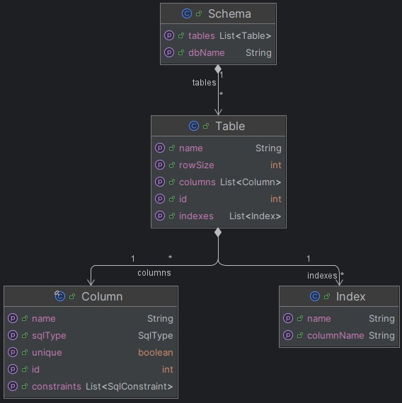

# Internal Model

The internal model used in the EleceDb database is structured to be both simple and efficient. This model consists of
several key components: the `Schema`, `Table`, `Column`, and `Index`.

## Schema

The `Schema` is the primary object and represents the full database model. There is only one `Schema` object per
instance of EleceDb, serving as the root container for all database objects.

## Table

Within the `Schema`, there can be multiple `Table` objects. Each `Table` represents a database table, containing:

- A list of `Column` objects: These define the structure and data storage of the table.
- A list of `Index` objects: These provide efficient data retrieval mechanisms.

## Column

Each `Column` object within a `Table` has the following properties:

- **Name**: A unique name relative to its table.
- **Id**: A unique identifier relative to its table.
- **Sql Type**: The type of data stored in the column (INT, VARCHAR, BOOL).
- **Constraints**: These dictate special restrictions, for now these constraints are only if the column is a primary key
  or unique. A corner case here is that the BOOL Sql Type does not support a constraint that build an index.

## Index

An `Index` is a tuple that associates a unique name with one or more columns in a table, facilitating efficient
querying. The properties include:

- **Name**: A unique name for the index.
- **Columns**: The columns that the index applies to.

Below is an illustration depicting the model:

