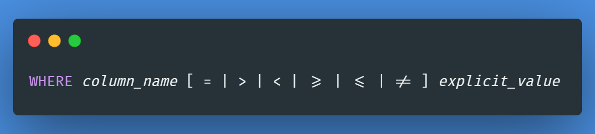

# Supported queries

The basic database queries are supported, and below you have a short description of all possible queries, as well as
some examples on how to use them:

`Create database` - Creates a database with the given name; For now we can only have one database per instance.

- Parameters:
    - **name** - the name of the database.

`Drop database` - Deletes a database with the given name; This will delete all traces of tables, rows and indexes.

- Parameters:
    - **name** - the name of the database.

`Create table` - Creates a new empty table.

- Parameters:
    - **table_name** - the name of the table.
    - **column_name** - the name of a column.
    - **data_type** - the type of the column, should be one of the following three:
        - `INT`: represents an integer
        - `BOOL`: represents a boolean
        - `VARCHAR`: represents a string. We can limit the size of the string, and the maximum size is 255 bytes.
    - **column_constraint** - optional attribute, if added can only be one of the following:
        - `PRIMARY KEY`
        - `UNIQUE`

`Drop table` - Deletes a previously existing table. This will delete all traces of rows and related indexes.

- Parameters:
    - **table_name** - the name of the table.

`Create index` - Creates an index on a table, if there are rows in the table, the existing values are also indexed.

- Parameters:
    - **index_name** - a unique name for the index.
    - **table_name** - the name of the table.
    - **column_name** - the name of the column that will be associated with the index.

`Delete` - Deletes rows from a table.

- Parameters:
    - **table_name** - the name of the table.
    - **condition** - optional expression attribute to define which rows should be deleted; If not present all rows are
      deleted. The `where` syntax is explained [here](#where-syntax).

`Insert` - Inserts a row into a table.

- Parameters:
    - **table_name** - the name of the table.
    - **column_name** - this only has two possibilities, either treat as optional and don't specify any column,
      internally this will translate to defining all columns. Or manually specify all columns in the table. There are no
      default values, so if any column is missing there'll be an error.
    - **row_values** - the values that belong to the row. There should be a value defined for each column of the table.

`Update` - Updates rows from a table.

- Parameters:
    - **table_name** - the name of the table.
    - **column_name** - the set of columns that are to be updated.
    - **expression** - the new value of the column being updated.
    - **condition** - optional expression attribute to define which rows should be updated; If not present all rows will
      be updated. The `where` syntax is explained [here](#where-syntax).

`Select` - Selects rows from a table.

- Parameters:
    - **column_name** - either select all columns using `*` or specify the desired columns manually separating them
      with a comma.
    - **table_name** - the name of the table.
    - **condition** - optional expression attribute to define which rows should be updated; If not present all rows will
      be updated. The `where` syntax is explained [here](#where-syntax).
    - **order_column_name** - optional expression, where we can define the order in which the rows are selected
      depending on a column.

## `Where` syntax

### Direct comparisons

This is the simplest type of where expressions. You define a column, an operator and an explicit value.

### Comparison with value assignment

We can also use value assignment expressions to see if a row fits the criteria.

### Logical combination

We can also have different combinations using logical operators, combining the two types of expressions previously
defined.