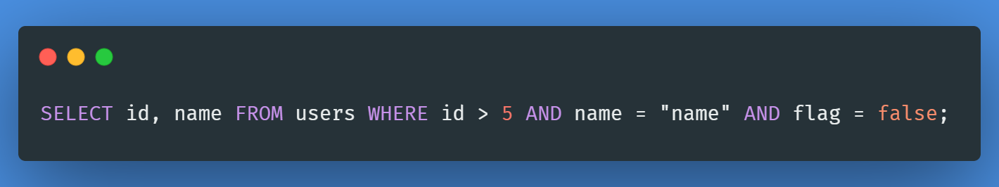
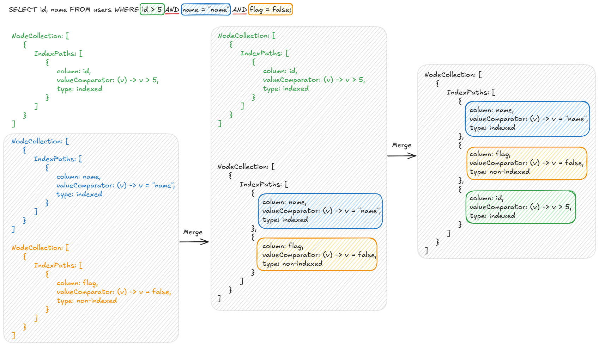
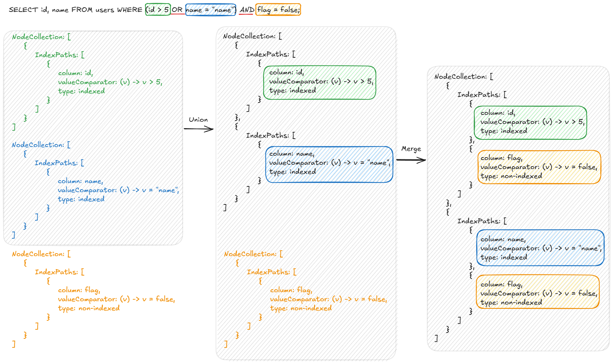
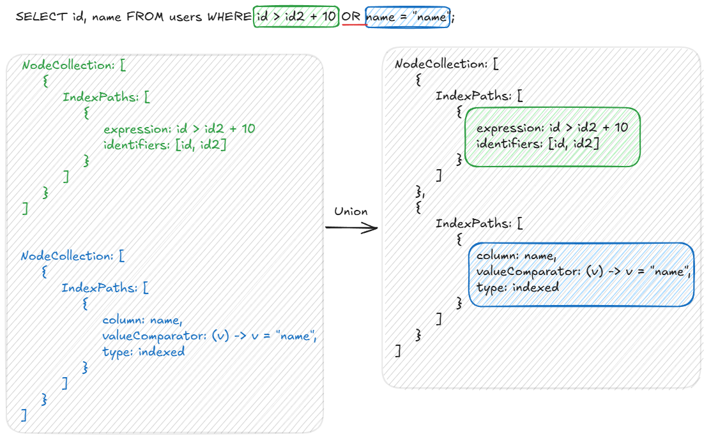

# `Where` expression pathing

Let's consider the following expression:

Here we can separate the expression into 3 parts:

- id > 5
- name = "name"
- flag = false

To process this we can look into the class `NodeCollection`.
The concept is simple, it wraps a Set of `IndexPath` and we can interpret this as, each element in the set
corresponds to a part of an OR expression, and each element itself wraps the parts of an AND.

To put this visually, we can break down this expression like this:

So initially each part was processed individually into their own `NodeCollection`, but then, we start merging them
so that in the end we only have a single object containing all the expressions.

The way this is interpreted is, we have a single AND expression (because the set inside of `IndexPath` only has a
single element),
and the existing `IndexPath` object is composed by the three expressions of the AND expression.
Then each expression is represented by the class `DefaultPathNode`.

Here is another example, but now we also have an OR expression, and we can see that the AND expression is actually
propagated to both parts of the OR:

There is a different scenario, using variable assignments. The class `ComplexPathNode` represents those expressions.

We follow the same principle, except they are stored separately in the `IndexPath` object.
Since we don't have the values that we need to be able to evaluate the expression, we store a list of the columns that
we need to extract to be able to execute the expression.

## Choosing the main scan path

To choose the rows that match the `where` expression, we first need to decide which part of the expression
should be the one to be used when reading the rows from disk.
This has a simple criteria:

- The nodes with the most priority are the nodes with the type of indexed. This means that an index related to that
  column exists, and we can use that to obtain the rows that match the criteria directly instead of reading all rows
  from the database and evaluate them one by one. For this we use b+ trees to obtain the indexes, and if valid we then
  fetch the row from disk. This is much more efficient than reading row by row.
- Between the indexed nodes, if the comparison is of equality, then it has a higher priority. Because the result of an
  equality expression is always at
  most a single row, resulting in much less read operations.
- If there are no indexed columns, we have to resort to scanning the full database, using a special b+ tree, which is
  the clustered index. Each row has a cluster id, so we use this tree to obtain the pointers to the rows, to be able to
  do a sequential scan.

All the other paths, except the one chosen as main scan path, are then used as a filter, in which we read the row from
disk fetched previously using the main path and compare the column values. This results in a single read for each row.